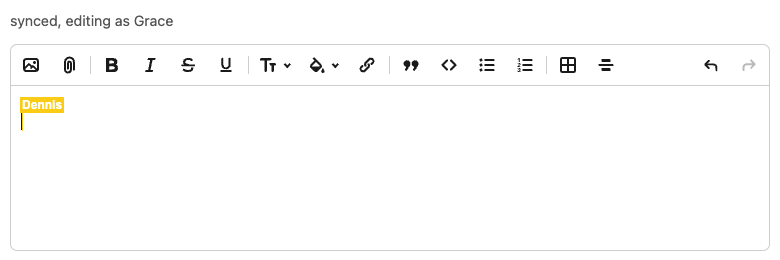
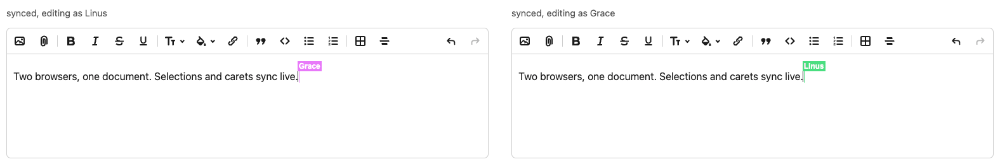

# lexxy-realtime

Real-time collaborative editing for [Lexxy](https://github.com/basecamp/lexxy)
over [Yjs](https://github.com/yjs/yjs). Drop a `<lexxy-collaboration>` element
inside your `<lexxy-editor>` and people editing the same document see each other's
**text, cursors, and selections** live.



Each side sees the other's cursor and selection:



## Rails

The whole setup is one gem, one generator, three lines. The npm package and the
Rails gem ship from this repo under the same name.

```bash
# Gemfile
gem "lexxy-realtime"
```
```bash
bin/rails generate lexxy_realtime:install
bin/rails db:migrate
npm install lexxy-realtime   # or yarn/bun/pnpm
```
```ruby
class Post < ApplicationRecord
  has_collaborative_rich_text :body
end
```
```erb
<%= form.collaborative_rich_textarea :body %>
```
```js
// app/javascript/application.js
import "lexxy-realtime"
```

Open the page in two browsers and edit together. A working app doing exactly
this lives in [`demo/`](demo/).

### What the generator created, and why

**A migration** — for two gem-owned tables (the models ship in the gem, the
way `ActionText::RichText` does). `lexxy_realtime_documents` is the
structural twin of Action Text's `rich_texts`: one row per collaborative
attribute, addressed by polymorphic `record` + `name`, holding
`materialized_at`. Your model gets a real association
(`collaborative_document_body`), and destroying a record sweeps its document
and log. `lexxy_realtime_updates` is the append-only CRDT log belonging to
the document, running yrby's `Y::UpdateLog`: `load` merges rows, `append`
adds one, and every 500 rows (`compact_every`) the log compacts into one
snapshot row so loads stay fast. The log is the transport's source of truth
while people edit; your Action Text table remains the artifact everything
else reads (next section). Swap the whole store with
`LexxyRealtime.store_name` (any class implementing `load`/`append`).

**A channel** — `DocumentChannel` speaks the Yjs sync protocol over Action
Cable (or AnyCable), backed by the store: every edit is recorded durably
before it's acknowledged or relayed, so replaying the log always rebuilds the
document. Clients join with a signed GlobalID minted by the form helper —
they never name documents directly, and a signed id from another feature
can't be replayed here. Tighten access further in `authorized?`.

### How it stays in sync with Action Text

`has_collaborative_rich_text :body` is a regular `has_rich_text` attribute
underneath. A few seconds after each change (`LexxyRealtime.materialize_after`),
a job renders the collaborative document to HTML **on the server** — yrby's
`Y::Lexxy` produces byte-identical markup to the editor's own serializer, no
Node anywhere — and saves it through the normal Action Text writer. So
`post.body` always reflects the collaborative state, and everything downstream
(rendering, search, mailers) is plain Action Text.

Reads are always fresh: the attribute reader checks whether the update log is
newer than the materialized value and, if so, materializes inline before
returning — leaving the editor for the show page never shows a stale body,
with no app code involved. Most reads find the value already fresh and pay one
indexed query, because materialization also runs through Active Job, scheduled
at edit time: every recorded change enqueues the (idempotent,
per-record-serialized) job with a short delay, so a closed browser, a killed
tab, or a dropped connection changes nothing — the last edit's job is already
queued. Nothing depends on a session ending cleanly. In development Active Job's built-in async adapter runs
it with zero setup; a stock Rails 8 app runs it on Solid Queue in production,
also with zero setup. Any Active Job backend works.

Records with an existing Action Text body work: on the first collaborative
open of a document, the element seeds it from the editor's server-rendered
value, so the stored content becomes the collaborative document (and an
intentional delete-everything materializes back as empty, like any other
edit). The one edge: two clients opening a never-collaborated document at the
same instant can both seed it, duplicating the initial content — the same
first-writer race as Lexical's own CollaborationPlugin bootstrap, confined to
a document's first-ever open.

### Who shows up on cursors

The helper resolves the collaborator's name from `current_user` (name,
username, handle, or email — first present wins) and derives a stable cursor
color from it. Customize either globally or per render:

```ruby
LexxyRealtime.identity = ->(view) { { name: view.current_user.handle, color: nil } }
```
```erb
<%= collaborative_rich_text_area form, :body, name: "Reviewer", color: "#0ea5e9" %>
```

Identity is presence metadata: it labels cursors for other collaborators.
Document access is what the signed GlobalID and `authorized?` gate.

## Beyond Rails: how it fits together

`<lexxy-collaboration>` works with any Yjs provider (`y-websocket`, Hocuspocus,
y-webrtc, ...). The Rails path above is the element's default wiring: it builds
a shared Action Cable consumer, a `Y.Doc`, and a
[`YrbyProvider`](https://github.com/jpcamara/yrby) from its attributes. You can
also hand it your own consumer, or a `Y.Doc` and provider for any backend —
yrby isn't involved in that path. lexxy-realtime is tested extensively against
the yrby stack; other providers plug into the small contract documented below.

## Requirements

- A **Lexxy editor** on the page (`@37signals/lexxy`) — see
  [Lexxy's docs](https://basecamp.github.io/lexxy).
- A backend for your **Yjs provider**; see [Server](#server-yrby) for the yrby
  setup.
- A **JS bundler** (jsbundling-rails / esbuild, or any app that bundles its
  JavaScript). Collaboration relies on one shared copy of `lexical` and `yjs`
  across Lexxy and lexxy-realtime; a bundler dedupes them for you (see
  [a single copy of lexical & yjs](#a-single-copy-of-lexical--yjs)).

## Install

```bash
npm install lexxy-realtime @lexical/yjs yjs y-protocols
```

You also need a Lexxy editor and `lexical` (`^0.44`), which your app already has.
Install the client transport for your setup: `@rails/actioncable` or
`@anycable/web` for yrby, or the package for your chosen Yjs provider (for
example, `y-websocket`).

## Client

`lexxy-realtime` registers the `<lexxy-collaboration>` custom element. Mount it
inside your `<lexxy-editor>` using one of these wirings.

### Default yrby path

#### Element-managed

Render (or create) the element with attributes inside the editor and import the
package once — nothing else. The element waits for the editor, creates a shared
Action Cable consumer (from the standard `action-cable-url` meta tag, falling
back to `/cable`), builds the doc and provider, connects, and disconnects on
removal:

```html
<lexxy-editor>
  <lexxy-collaboration doc-id="doc-42" name="Ada"
    channel-name="DocumentChannel" channel-params='{"id":"doc-42"}'>
  </lexxy-collaboration>
</lexxy-editor>
```

```js
import "@37signals/lexxy";
import "lexxy-realtime"; // registers <lexxy-collaboration>
```

To use a specific consumer (for example `@anycable/web`), assign it before the
element initializes:

```js
const collab = document.querySelector("lexxy-collaboration");
collab.consumer = createCable(); // or createConsumer() from @rails/actioncable
```

#### Host-managed

Create and manage the yrby provider yourself when you need its lifecycle for
status UI, `whenSynced`, or sharing one document across components:

```js
import "@37signals/lexxy";                          // registers <lexxy-editor>
import { YrbyProvider } from "lexxy-realtime";   // registers <lexxy-collaboration>
import * as Y from "yjs";
import { createConsumer } from "@rails/actioncable"; // or "@anycable/web"

const editor = document.querySelector("lexxy-editor");

function startCollaborating() {
  const doc = new Y.Doc();
  const consumer = createConsumer();
  const provider = new YrbyProvider(doc, consumer, "DocumentChannel", { id: documentId });

  const collab = document.createElement("lexxy-collaboration");
  collab.setAttribute("doc-id", documentId);       // Yjs document id (defaults to "main")
  collab.setAttribute("name", currentUserName);    // shown on your cursor to others
  collab.setAttribute("color", "#3b82f6");          // optional cursor color
  collab.doc = doc;
  collab.provider = provider;
  editor.appendChild(collab);

  provider.connect(); // YrbyProvider does not auto-connect
}

// Lexxy sets up its editor asynchronously; start once it's ready.
if (editor.editor) {
  startCollaborating();
} else {
  editor.addEventListener("lexxy:initialize", startCollaborating, { once: true });
}
```

### Bring your own Yjs provider

Create the document and provider, then assign both to the element. This example
uses a Node `y-websocket` server:

```js
import "@37signals/lexxy";
import "lexxy-realtime"; // registers <lexxy-collaboration>
import * as Y from "yjs";
import { WebsocketProvider } from "y-websocket";

const editor = document.querySelector("lexxy-editor");

function startCollaborating() {
  const doc = new Y.Doc();
  const provider = new WebsocketProvider("wss://your-server", documentId, doc);

  const collab = document.createElement("lexxy-collaboration");
  collab.setAttribute("name", currentUserName);
  collab.doc = doc;
  collab.provider = provider;
  editor.appendChild(collab);
  // y-websocket connects on construction — no connect() call needed.
}

if (editor.editor) startCollaborating();
else editor.addEventListener("lexxy:initialize", startCollaborating, { once: true });
```

Point the provider at its own backend. Nothing else in the client wiring changes.

#### Provider contract

Any provider with the standard Yjs surface works:

- `provider.awareness` — a [`y-protocols`](https://github.com/yjs/y-protocols)
  `Awareness` instance (used for remote cursors/selections).
- `provider.synced` — `true` once caught up with the server (used to seed a
  brand-new, empty document the first time).
- `provider.disconnect()` — called when the element is removed.

You start the connection however that provider expects (`provider.connect()` for
`YrbyProvider`; `y-websocket` connects on construction). `y-websocket`,
Hocuspocus, and y-webrtc all satisfy this.

## Server (yrby)

Collaboration needs a server that records and relays Yjs updates. The Rails
gem's installer generates this channel for you (see [Rails](#rails)); this
section is the manual wiring for apps using yrby directly, via the
[`yrby-actioncable`](https://rubygems.org/gems/yrby-actioncable) concern:

```ruby
# Gemfile: gem "yrby-actioncable"

class DocumentChannel < ApplicationCable::Channel
  include Y::ActionCable

  # Rebuild a document's state from your store (return nil for a new doc):
  on_load   { |id| Document.find_by(id:)&.yjs_state }
  # Persist each CRDT delta before it's acked/relayed:
  on_change { |id, update| Document.record!(id, update) }

  def subscribed = sync_subscribed(params[:id])
  def receive(data) = sync_receive(data, params[:id])
end
```

See [`yrby`](https://github.com/jpcamara/yrby) for durable-store options
and the full protocol (reliable delivery, causal-gap handling).

## Provider API (yrby)

`YrbyProvider` is a thin alias for `yrby-client`'s `ActionCableProvider`:

```js
provider.connect();        // open the subscription and start syncing
provider.disconnect();     // pause; queued edits are kept
provider.destroy();        // tear down (also clears presence)

provider.synced;           // caught up with the server?
await provider.whenSynced; // resolves on the first catch-up (immediately if already synced)
provider.status;           // "connecting" | "connected" | "synced" | "disconnected"
provider.onStatusChange(({ status }) => render(status)); // returns an unsubscribe fn
provider.awareness;        // the Yjs Awareness instance (presence/cursors)
provider.hasPending;       // unacknowledged local edits in flight?
```

It owns presence — it creates its own `Awareness`. Read `provider.awareness` if
you need it (e.g. to show who's here); don't pass one in.

## Persisting to ActionText (manual)

The Rails gem does this for you (see
[How it stays in sync with Action Text](#how-it-stays-in-sync-with-action-text));
this section is the underlying pattern for apps wiring yrby directly.

The collaborative document lives in your durable store as CRDT updates.
When the rest of your app needs it as rich text — display, search, mailers
— render it server-side with the `yrby` gem's `Y::Lexxy`, which reproduces
Lexxy's own HTML byte for byte:

```ruby
ydoc = Y::Doc.new
ydoc.apply_update(store.replay(document_id))
html = Y::Lexxy.new(ydoc).to_html("root")
note.content = html # a has_rich_text attribute
```

No browser is involved and no client-submitted HTML is trusted. The
[yrby demo's `NoteMaterializer`](https://github.com/jpcamara/yrby/blob/main/examples/actioncable-demo/app/lib/note_materializer.rb)
shows the full pattern, refreshed on read with a store-version staleness
check.

## Turbo

Two things matter under Turbo Drive:

- Run your wiring on `turbo:load` (or make the editor page a Turbo frame
  boundary), so a fresh `<lexxy-collaboration>` mounts per visit. The
  element tears down cleanly on removal — unmount before first sync,
  DOM moves, and remounts are all covered by the test suite.
- Don't cache a live editor: mark the editor container
  `data-turbo-temporary` (or `data-turbo-cache="false"` on the page) so
  Turbo's snapshot doesn't restore a stale editor DOM next to a fresh
  binding.

## A single copy of `lexical` & `yjs`

Lexxy and lexxy-realtime both leave `lexical` (and lexxy-realtime leaves `yjs` /
`@lexical/yjs`) as external peers, so your bundler can resolve them to one shared
instance. They **must** be a single copy: Lexical keys node behavior to class
identity and Yjs to constructor identity, so two copies break syncing. With
matching versions (`lexical ^0.44`, `yjs ^13.6`) bundlers dedupe automatically;
if yours pulls duplicates, dedupe them (e.g. esbuild
`--alias:yjs=./node_modules/yjs`).

## Try it

The [`yrby` Action Cable demo](https://github.com/jpcamara/yrby/tree/main/examples/actioncable-demo)
runs a Lexxy editor on lexxy-realtime end to end (there's a one-command Docker
setup). Open `/docs/demo/lexxy` in two windows and type.

## Notes

lexxy-realtime applies two small compatibility shims to `@lexical/yjs` and
`@37signals/lexxy` **at runtime, from inside its own bind path** — no
`patch-package`, no vendored patches, install the peers and go. They're temporary
pending upstream fixes; the details and tracking PRs are in
[`CONTRIBUTING.md`](CONTRIBUTING.md).

## License

MIT
