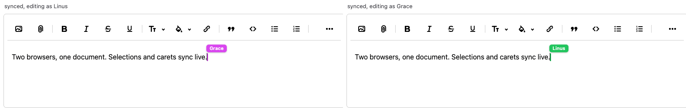

# lexxy-realtime

Real-time collaborative editing for [Lexxy](https://github.com/basecamp/lexxy)
over [Yjs](https://github.com/yjs/yjs). Drop a `<lexxy-collaboration>` element
inside your `<lexxy-editor>` and people editing the same document see each other's
**text, cursors, and selections** live.


Each side sees the other's cursor and selection:



## Rails

Setup is a gem, a generator, and a JS import. The npm package and the
Rails gem ship from this repo under the same name.

```bash
# Gemfile
gem "lexxy-realtime"
```
```bash
bin/rails generate lexxy_realtime:install
bin/rails db:migrate
npm install lexxy-realtime   # or yarn/bun/pnpm
```
```ruby
class Post < ApplicationRecord
  has_collaborative_rich_text :body
end
```
```erb
<%= form.collaborative_rich_textarea :body %>
```
```js
// app/javascript/application.js
import "lexxy-realtime"
```

Implement `authorized?` in the generated channel (everyone is denied
until you do), then open the page in two browsers and edit together.

### What the generator created, and why

**A migration** for yrby's two tables (the models, `Y::Document` and
`Y::DocumentUpdate`, ship in the yrby-rails gem, the way
`ActionText::RichText` ships in Action Text). `y_documents` follows the
shape of Action Text's `rich_texts`: one row per collaborative document,
addressed by a unique transport `key` and, when bound to a model, by
polymorphic `record` + `name`, plus the merged `state` snapshot. Your
model gets a real association (`collaborative_document_body`), and
destroying a record destroys its document and update history.
`y_document_updates` holds the uncompacted tail: one CRDT delta per row,
compacted into `state` and deleted once the tail reaches the compaction
threshold, which keeps a load to one row plus the current tail. While
people edit, the document holds the real content; `post.body` is
re-rendered from it for everything else to read (next section). Manual
yrby channels can point `on_load`/`on_change` at any store; the model
integration here uses `Y::Document`.

**A channel**: `DocumentChannel` speaks the Yjs sync protocol over Action
Cable (or AnyCable), backed by `Y::Document`: every edit is recorded durably
before it's acknowledged or relayed, so replaying the log always rebuilds the
document. Clients join with a signed GlobalID minted by the form helper;
they never name documents directly, and a signed id from another feature
can't be replayed here. The token is scoped to the record and the
field, so one attribute's token can't open another. The signed id doesn't
check who is connecting: the generated `authorized?` denies everyone
until you wire it to your app's auth.

### How it stays in sync with Action Text

`has_collaborative_rich_text :body` is a regular `has_rich_text` attribute
underneath. After recording each change, the channel renders the
collaborative document to HTML **on the server** and saves it through
the normal Action Text writer. yrby's `Y::Lexxy` produces byte-identical
markup to the editor's own serializer, in Ruby. So `post.body` tracks
the collaborative state, and everything downstream (rendering, search,
mailers) is plain Action Text.

The render happens inline on every recorded change: no job, no delay
window, and reads are plain reads. A closed browser or killed tab changes
nothing: the last recorded change was already rendered. If a render fails
(or a process dies between recording and rendering), the document is
still durable and the attribute catches up on the next successful
change.

Records with an existing Action Text body work: on the first collaborative
open of a document, the element seeds it from the editor's server-rendered
value, so the stored content becomes the collaborative document (and an
intentional delete-everything materializes back as empty, like any other
edit). The one edge: two clients opening a never-collaborated document at the
same instant can both seed it, duplicating the initial content, the same
first-writer race as Lexical's own CollaborationPlugin bootstrap, confined to
a document's first-ever open.

### Cursor identity

The helper resolves the collaborator's name from `current_user` (name,
username, or handle; first present wins, otherwise "Anonymous") and
derives a stable cursor color from it. Customize either globally or per render:

```ruby
LexxyRealtime.identity = ->(view) { { name: view.current_user.handle, color: nil } }
```
```erb
<%= form.collaborative_rich_textarea :body, name: "Reviewer", color: "#0ea5e9" %>
```

Identity is presence metadata: it labels cursors for other collaborators.
Document access is the channel's job: the signed GlobalID plus
`authorized?`.

## Beyond Rails: how it fits together

`<lexxy-collaboration>` works with any Yjs provider (`y-websocket`, Hocuspocus,
y-webrtc, ...). The Rails path above is the element's default wiring: it builds
a shared Action Cable consumer, a `Y.Doc`, and a
[`YrbyProvider`](https://github.com/jpcamara/yrby) from its attributes. You can
also hand it your own consumer, or a `Y.Doc` and provider for any backend;
yrby isn't involved in that path. lexxy-realtime is tested extensively against
the yrby stack; other providers plug into the small contract documented below.

## Requirements

- A **Lexxy editor** on the page (`@37signals/lexxy`); see
  [Lexxy's docs](https://basecamp.github.io/lexxy).
- A backend for your **Yjs provider**; see [Server](#server-yrby) for the yrby
  setup.
- A **JS bundler** (jsbundling-rails / esbuild, or any app that bundles its
  JavaScript). Collaboration relies on one shared copy of `lexical` and `yjs`
  across Lexxy and lexxy-realtime; a bundler dedupes them for you (see
  [a single copy of lexical & yjs](#a-single-copy-of-lexical--yjs)).

## Install

```bash
npm install lexxy-realtime @lexical/yjs yjs y-protocols
```

You also need a Lexxy editor and `lexical` (`^0.44`), which your app already has.
Install the client transport for your setup: `@rails/actioncable` or
`@anycable/web` for yrby, or the package for your chosen Yjs provider (for
example, `y-websocket`).

## Client

`lexxy-realtime` registers the `<lexxy-collaboration>` custom element. Mount it
inside your `<lexxy-editor>` using one of these wirings.

### Default yrby path

#### Element-managed

Render (or create) the element with attributes inside the editor and import the
package once. The element waits for the editor, creates a shared
Action Cable consumer (from the standard `action-cable-url` meta tag, falling
back to `/cable`), builds the doc and provider, connects, and disconnects on
removal:

```html
<lexxy-editor>
  <lexxy-collaboration doc-id="doc-42" name="Ada"
    channel-name="DocumentChannel" channel-params='{"id":"doc-42"}'>
  </lexxy-collaboration>
</lexxy-editor>
```

```js
import "@37signals/lexxy";
import "lexxy-realtime"; // registers <lexxy-collaboration>
```

To use a specific consumer (for example `@anycable/web`), assign it before the
element initializes:

```js
const collab = document.querySelector("lexxy-collaboration");
collab.consumer = createCable(); // or createConsumer() from @rails/actioncable
```

#### Host-managed

Create and manage the yrby provider yourself when you need its lifecycle for
status UI, `whenSynced`, or sharing one document across components:

```js
import "@37signals/lexxy";                          // registers <lexxy-editor>
import { YrbyProvider } from "lexxy-realtime";   // registers <lexxy-collaboration>
import * as Y from "yjs";
import { createConsumer } from "@rails/actioncable"; // or "@anycable/web"

const editor = document.querySelector("lexxy-editor");

function startCollaborating() {
  const doc = new Y.Doc();
  const consumer = createConsumer();
  const provider = new YrbyProvider(doc, consumer, "DocumentChannel", { id: documentId });

  const collab = document.createElement("lexxy-collaboration");
  collab.setAttribute("doc-id", documentId);       // Yjs document id (defaults to "main")
  collab.setAttribute("name", currentUserName);    // shown on your cursor to others
  collab.setAttribute("color", "#3b82f6");          // optional cursor color
  collab.doc = doc;
  collab.provider = provider;
  editor.appendChild(collab);

  provider.connect(); // YrbyProvider does not auto-connect
}

// Lexxy sets up its editor asynchronously; start once it's ready.
if (editor.editor) {
  startCollaborating();
} else {
  editor.addEventListener("lexxy:initialize", startCollaborating, { once: true });
}
```

### Bring your own Yjs provider

Create the document and provider, then assign both to the element. This example
uses a Node `y-websocket` server:

```js
import "@37signals/lexxy";
import "lexxy-realtime"; // registers <lexxy-collaboration>
import * as Y from "yjs";
import { WebsocketProvider } from "y-websocket";

const editor = document.querySelector("lexxy-editor");

function startCollaborating() {
  const doc = new Y.Doc();
  const provider = new WebsocketProvider("wss://your-server", documentId, doc);

  const collab = document.createElement("lexxy-collaboration");
  collab.setAttribute("name", currentUserName);
  collab.doc = doc;
  collab.provider = provider;
  editor.appendChild(collab);
  // y-websocket connects on construction; no connect() call needed.
}

if (editor.editor) startCollaborating();
else editor.addEventListener("lexxy:initialize", startCollaborating, { once: true });
```

Point the provider at its own backend. Nothing else in the client wiring changes.

#### Provider contract

Any provider with the standard Yjs surface works:

- `provider.awareness`: a [`y-protocols`](https://github.com/yjs/y-protocols)
  `Awareness` instance (used for remote cursors/selections).
- `provider.synced`: `true` once caught up with the server (used to seed a
  brand-new, empty document the first time).
- `provider.disconnect()`: called when the element is removed.

You start the connection however that provider expects (`provider.connect()` for
`YrbyProvider`; `y-websocket` connects on construction). `y-websocket`,
Hocuspocus, and y-webrtc all satisfy this.

## Server (yrby)

Collaboration needs a server that records and relays Yjs updates. The Rails
gem's installer generates this channel for you (see [Rails](#rails)); this
section is the manual wiring for apps using yrby directly, via the
[`yrby-rails`](https://rubygems.org/gems/yrby-rails) concern:

```ruby
# Gemfile: gem "yrby-rails"

class DocumentChannel < ApplicationCable::Channel
  include Y::ActionCable

  # Rebuild a document's state from your store (return nil for a new doc):
  on_load   { |id| Document.find_by(id:)&.yjs_state }
  # Persist each CRDT delta before it's acked/relayed:
  on_change { |id, update| Document.record!(id, update) }

  def subscribed = sync_subscribed(params[:id])
  def receive(data) = sync_receive(data, params[:id])
end
```

See [`yrby`](https://github.com/jpcamara/yrby) for durable-store options
and the full protocol (reliable delivery, causal-gap handling).

## Provider API (yrby)

`YrbyProvider` is a thin alias for `yrby-client`'s `ActionCableProvider`:

```js
provider.connect();        // open the subscription and start syncing
provider.disconnect();     // pause; queued edits are kept
provider.destroy();        // tear down (also clears presence)

provider.synced;           // caught up with the server?
await provider.whenSynced; // resolves on the first catch-up (immediately if already synced)
provider.status;           // "connecting" | "connected" | "synced" | "disconnected"
provider.onStatusChange(({ status }) => render(status)); // returns an unsubscribe fn
provider.awareness;        // the Yjs Awareness instance (presence/cursors)
provider.hasPending;       // unacknowledged local edits in flight?
```

The element creates and owns its own `Awareness`. Read `provider.awareness`
if you need it (e.g. to show who's here); don't pass one in.

## Attachments

File and image uploads work under collaboration. The uploader's
browser does the ActiveStorage direct upload as usual; the attachment node
syncs through Yjs, and peers render the finished image from its URL. While
an upload is in flight, peers see a placeholder with the filename and a
live progress bar. Nothing client-local crosses the wire: the `File`
object, preview object-URLs, and upload configuration stay on the
uploader's machine, and a peer never starts a duplicate upload.

## Persisting to ActionText (manual)

The Rails gem does this for you (see
[How it stays in sync with Action Text](#how-it-stays-in-sync-with-action-text));
this section is the underlying pattern for apps wiring yrby directly.

The collaborative document lives in your durable store as CRDT updates.
When the rest of your app needs it as rich text (display, search,
mailers), render it server-side with the `yrby` gem's `Y::Lexxy`, which reproduces
Lexxy's own HTML byte for byte:

```ruby
ydoc = Y::Doc.new
ydoc.apply_update(store.replay(document_id))
html = Y::Lexxy.new(ydoc).to_html("root")
note.content = html # a has_rich_text attribute
```

No browser is involved and no client-submitted HTML is trusted. The
[yrby demo's `NoteMaterializer`](https://github.com/jpcamara/yrby/blob/main/examples/actioncable-demo/app/lib/note_materializer.rb)
shows the same server-side rendering in a store-agnostic form.

## Turbo

Two things matter under Turbo Drive:

- Run your wiring on `turbo:load` (or make the editor page a Turbo frame
  boundary), so a fresh `<lexxy-collaboration>` mounts per visit. The
  element tears down cleanly on removal: unmount before first sync,
  DOM moves, and remounts are all covered by the test suite.
- Don't cache a live editor: mark the editor container
  `data-turbo-temporary` (or `data-turbo-cache="false"` on the page) so
  Turbo's snapshot doesn't restore a stale editor DOM next to a fresh
  binding.

## A single copy of `lexical` & `yjs`

Lexxy and lexxy-realtime both leave `lexical` (and lexxy-realtime leaves `yjs` /
`@lexical/yjs`) as external peers, so your bundler can resolve them to one shared
instance. They must resolve to a single installed copy: Lexical keys node behavior to
class identity and Yjs to constructor identity, so two copies break syncing. With
matching versions (`lexical ^0.44`, `yjs ^13.6`) bundlers dedupe automatically;
if yours pulls duplicates, dedupe them (e.g. esbuild
`--alias:yjs=./node_modules/yjs`).

## Try it

The [`yrby` Action Cable demo](https://github.com/jpcamara/yrby/tree/main/examples/actioncable-demo)
runs a Lexxy editor on lexxy-realtime end to end (there's a one-command Docker
setup). Open `/docs/demo/lexxy` in two windows and type.

## Notes

lexxy-realtime applies one small compatibility patch to `@lexical/yjs` at
runtime, from inside its own bind path. No `patch-package`, no vendored
patches. It's temporary pending an upstream fix; details in
[`CONTRIBUTING.md`](CONTRIBUTING.md). Lexxy itself needs the no-arg
construction fix (basecamp/lexxy#1196), merged upstream and awaiting a
release.

## License

MIT
