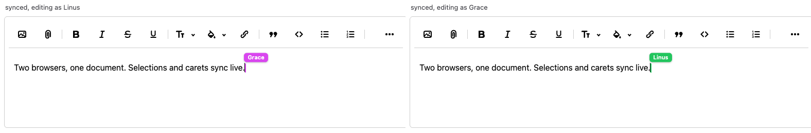

# lexxy-realtime

Real-time collaborative editing for [Lexxy](https://github.com/basecamp/lexxy),
the modern rich text editor for Rails. Render the editor with
`form.collaborative_rich_textarea` and everyone on the same document sees
each other's **text, cursors, and selections** live.


Each side sees the other's cursor and selection:



The editors sync Yjs updates over Action Cable or AnyCable through
[yrby](https://github.com/jpcamara/yrby). The server stores every update
before acknowledging it, then renders the document back into Action Text.
`post.body` is still a normal rich text attribute, so the rest of your app
(rendering, search, mailers) reads it as usual.

## Quick start

Add the gem and run the installer:

```bash
# Gemfile
gem "lexxy-realtime"
```

```bash
bin/rails generate lexxy_realtime:install
bin/rails db:migrate
```

The generator creates the document tables. If the app uses import maps, it
also adds the import-map pins. The channel ships in the gem.

Make a rich text attribute collaborative:

```ruby
class Post < ApplicationRecord
  has_collaborative_rich_text :body
end
```

Render the collaborative editor in your form:

```erb
<%= form.collaborative_rich_textarea :body %>
```

Load the JavaScript. **With import maps** (propshaft + importmap-rails),
the generator already added the pins. The page loads one copy each of
lexical (the one embedded in Lexxy's own asset), yrby-client, and yjs.
Import the packages:

```js
// app/javascript/application.js
import "@37signals/lexxy"
import "lexxy-realtime"
```

With a JavaScript bundler (esbuild, webpack, bun), install the npm package
and use the same imports. npm and bun install its peers (`lexical`, `yjs`,
and the rest) automatically. Yarn only warns about them, so with Yarn add
`@lexical/yjs yjs y-protocols` yourself:

```bash
npm install lexxy-realtime
```

You don't need to write a channel. The form helper renders a signed grant
for the record and field, and the gem's channel opens a document only when
the grant is valid. Render the form only for users who may edit the record.
Then open the page in two browsers and type.

## Try it

The app in [`demo/`](demo/) uses this exact setup. Run `bin/setup`, create a
post, and open its edit page in two windows.

## Contents

- [Quick start](#quick-start)
- [Try it](#try-it)
- [How it works](#how-it-works)
- [The Rails side](#the-rails-side)
  - [Database tables](#database-tables)
  - [The document channel](#the-document-channel)
  - [Encrypted storage](#encrypted-storage)
  - [How it stays in sync with Action Text](#how-it-stays-in-sync-with-action-text)
  - [Custom Lexical nodes](#custom-lexical-nodes)
  - [Cursor identity](#cursor-identity)
- [The JavaScript client](#the-javascript-client)
  - [Install](#install)
  - [Bind to a yrby-document](#bind-to-a-yrby-document)
  - [Assign a doc and provider](#assign-a-doc-and-provider)
  - [When a remote update fails](#when-a-remote-update-fails)
  - [A single copy of lexical and yjs](#a-single-copy-of-lexical-and-yjs)
- [Providers](#providers)
  - [The yrby provider API](#the-yrby-provider-api)
  - [Bring your own Yjs provider](#bring-your-own-yjs-provider)
  - [Provider contract](#provider-contract)
  - [Manual server setup (yrby without the gem)](#manual-server-setup-yrby-without-the-gem)
  - [Manual Action Text rendering](#manual-action-text-rendering)
- [AnyCable](#anycable)
- [Attachments](#attachments)
- [Turbo](#turbo)
- [Requirements](#requirements)

## How it works

The form helper renders a `<yrby-document>` element from
[yrby-client](https://github.com/jpcamara/yrby/tree/main/packages/client)
around the Lexxy editor, with `<lexxy-collaboration>` inside the editor.
`<yrby-document>` subscribes to the channel with a signed grant and holds a
document session: the `Y.Doc`, the provider, and any edits the server
hasn't acknowledged yet. When the session first syncs,
`<lexxy-collaboration>` binds the editor's Lexical instance to that
`Y.Doc`. Every edit goes out as a CRDT update. The channel records it
before acknowledging or broadcasting it, so the stored log can always
rebuild the document. After each change the server renders the document to
HTML with the same output as the editor's own serializer and saves it
through the normal Action Text writer.

The element also works with any Yjs provider that exposes awareness and a
synced flag (`y-websocket`, Hocuspocus). Assign the doc and provider
yourself and leave out `<yrby-document>`. yrby is the default and has the
most test coverage.

## The Rails side

This section covers what `bin/rails generate lexxy_realtime:install` sets up
and how the gem keeps Action Text in sync with the collaborative document.

### Database tables

The migration creates `y_documents` and `y_document_updates`. Their models,
`Y::Document` and `Y::DocumentUpdate`, come from `yrby-rails`.

A document belongs to a model through `record` and `name`, much like
`ActionText::RichText`. It also has a unique transport `key` and stores the
compacted Yjs state. Destroying the model deletes its document and update
rows.

Each incoming update is appended to `y_document_updates`. At the compaction
threshold, yrby merges those updates into `y_documents.state` and deletes the
old rows. The channel renders the document into `post.body` after each
change. Apps that use yrby directly can plug in a different store through
`on_load` and `on_change`.

### The document channel

`LexxyRealtime::DocumentChannel` ships in the gem. It is yrby-rails'
`Y::DocumentChannel` with one extra step: after it saves an update, it
renders the document to HTML and saves that to the Action Text field. Each
update is saved before it is acknowledged or broadcast, so the stored log
can always rebuild the document.

The form helper gives the browser a signed grant for one record and field.
Only `LexxyRealtime::DocumentChannel` accepts it. To also check the user's
permissions when they subscribe, use
`LexxyRealtime::DocumentChannel.authorize_document`. The
[Rails gem README](rails/README.md#access-control) shows how.

### Encrypted storage

`has_collaborative_rich_text :body, encrypted: true` stores the rendered body
with `ActionText::EncryptedRichText`. The Yjs state and updates use yrby's
encrypted document models. Both are encrypted with Active Record encryption.

### How it stays in sync with Action Text

`has_collaborative_rich_text :body` is a regular `has_rich_text` attribute
underneath. After storing each change, the channel renders the collaborative
document to HTML on the server and saves it through the normal Action Text
writer. yrby's `Y::Lexxy` does the rendering in Ruby and produces the same
markup as the editor's own serializer. So `post.body` follows
the collaborative document, and everything that reads it (rendering, search,
mailers) sees plain Action Text.

Each update is rendered synchronously, so `post.body` is current when the
channel call returns. Once the server has stored an update, closing the
browser doesn't lose it. If rendering fails, the next successful update
renders the whole document again.

When collaboration starts on a record that already has Action Text content,
the client seeds the Yjs document from the editor's rendered value. If
someone clears the editor later, an empty body is saved.

There is one race on the first open. If two clients both seed the document
before either finishes syncing, the initial content appears twice. Lexical's
`CollaborationPlugin` behaves the same way. The duplicate is visible and can
be deleted.

### Custom Lexical nodes

Your JavaScript renders custom nodes in the editor. The stored HTML comes
from `Y::Lexxy` on the server, which only knows core Lexical nodes and
Lexxy's own. When it finds a node type it doesn't know, it renders what it
can:

- An element node (a container or an inline wrapper) renders its children
  without its own tag. The text is kept.
- A decorator node (an embed, a poll, a widget that keeps its content in
  attributes) renders nothing.
- A `TextNode` subclass, such as a hashtag, syncs as a plain text run and
  renders as its text. Rules can't target text runs.

The editors still draw the node with your JavaScript. `post.body` gets the
reduced version, and so does everything that reads it: mailers, search,
read-only views. A node registered through Lexical's node replacement counts
as custom, because its type name is what syncs.

Add render rules for your node types to the field:

```ruby
has_collaborative_rich_text :body, nodes: {
  "poll" => ->(node) {
    %(<div class="poll" data-poll-id="#{Y::RenderRules.escape_attr(node.attrs["__pollId"])}"></div>)
  }
}
```

These are `Y::Lexxy` rules. yrby's
[custom nodes docs](https://github.com/jpcamara/yrby#custom-nodes-and-marks)
describe the forms they can take. Escape every attribute value you put into
markup with `Y::RenderRules.escape_attr` or `escape_text`. Collaborators can
write any value into those attributes, and the result appears on every
reader's page.

When a document contains node types that have no rule, lexxy-realtime logs a
warning that names them. It logs once per model, field, and set of types. To
catch a missing rule in CI, render a real document from your editor in a test
and assert that `Y::Lexxy.new(doc, nodes: rules).unknown_types` is empty.

### Cursor identity

The helper takes the cursor name from `current_user`, using the first of
`name`, `username`, or `handle` that has a value. If none does, it uses
`"Anonymous"`. The cursor color is derived from the name, so it's the same
on every page load. You can change either globally or per render:

```ruby
LexxyRealtime.identity = ->(view) { { name: view.current_user.handle, color: nil } }
```

```erb
<%= form.collaborative_rich_textarea :body, name: "Reviewer", color: "#0ea5e9" %>
```

Cursor names and colors are sent as presence metadata. The channel finds the
record from the signed grant and checks access with your `authorize_document`
block, if you set one.

The client sends its own cursor name, so a modified client can show any name
it likes. Under AnyCable, presence goes out as whispers that the server never
sees. A client can't give itself access, though. The server checks the signed
grant and your `authorize_document` block before any read or write. Don't use
the name on a cursor to decide who someone is.

## The JavaScript client

`lexxy-realtime` registers two custom elements: `<lexxy-collaboration>`,
and yrby-client's `<yrby-document>`. In a Rails app the form helper renders
both, and you only import the package. You can also assign your own
document and provider (see [Providers](#providers)).

### Install

**Import maps**: the install generator adds a pin for each module the
page must load once:

```ruby
# config/importmap.rb, added by the generator
pin "@37signals/lexxy", to: "lexxy.js"
pin "lexxy-realtime", to: "lexxy_realtime/lexxy-realtime.js"
pin "yrby-client", to: "lexxy_realtime/yrby-client.js"
pin "yrby-client/element", to: "lexxy_realtime/yrby-client.js"
pin "yjs", to: "lexxy_realtime/yjs.js"
pin "@rails/actioncable", to: "actioncable.esm.js"
pin "@rails/activestorage", to: "activestorage.esm.js"
```

`@37signals/lexxy` is an alias of the app's own Lexxy asset (the same file
as Lexxy's `lexxy` pin; one URL, one module). The lexxy-realtime build
reaches lexical through Lexxy's documented `Lexical` re-export, so the
page runs one copy of lexical: the editor's. yrby-client and yjs are
separate files that lexxy-realtime imports, so code of your own that
imports them shares the same `<yrby-document>` class, session store, and
Yjs. `@rails/actioncable` is Rails' own file. A pin your app already has
is kept, and re-running the generator adds only missing pins. Nothing to
install; import the packages in your entry point.

**Bundlers.** Install the npm package. npm and bun install its peers
automatically. With Yarn, add `@lexical/yjs yjs y-protocols` yourself:

```bash
npm install lexxy-realtime
```

You also need a Lexxy editor and `lexical` (`^0.44`), which your app already
has. The package depends on `yrby-client` and `@rails/actioncable`, which
`<yrby-document>` uses for its default consumer. Install `@anycable/web`
when configuring [AnyCable](#anycable), or the client package for your own
Yjs provider (for example, `y-websocket`).

Either way, the entry point imports are the same:

```js
import "@37signals/lexxy";
import "lexxy-realtime"; // registers <lexxy-collaboration> and <yrby-document>
```

### Bind to a `<yrby-document>`

This is the markup the form helper renders:

```html
<yrby-document grant="..." name="body" channel="LexxyRealtime::DocumentChannel"
  refresh="/posts/42/grant">
  <lexxy-editor>
    <lexxy-collaboration doc-id="post-42-body" name="Ada" color="#3b82f6">
    </lexxy-collaboration>
  </lexxy-editor>
</yrby-document>
```

`<lexxy-collaboration>` finds its closest `<yrby-document>` and binds the
editor when that element dispatches `yrby:synced`. It handles an editor
that initializes after the sync, and an element added after the event
already fired. When the session's signal aborts, the element unbinds the
editor. It never destroys the doc or provider, and never disconnects the
consumer, because the session owns them.

`<yrby-document>` keeps the editor inert until its session first syncs, so
nobody types into a document that can't sync yet. A rejected grant with no
`refresh` URL, or a refresh that fails, makes the editor inert until the
next page render.

`<yrby-document>` keeps the session alive while edits are waiting for the
server, so removing the editor doesn't lose them. Moving the editor within
one turn keeps the same session. A rejected grant with a `refresh` URL is
renewed without losing the document (see the
[Rails gem README](rails/README.md#grant-lifetime-and-refresh)). The
[yrby-client README](https://github.com/jpcamara/yrby/tree/main/packages/client#yrby-document-the-easiest-path)
covers sessions, Turbo, and errors in detail.

`<yrby-document>` creates an `@rails/actioncable` consumer from the
standard `action-cable-url` meta tag, falling back to `/cable`. To use a
specific transport (for example `@anycable/web`), set the consumer once at
boot, before any editors mount:

```js
import { createConsumer } from "@anycable/web";
import { setConsumer } from "lexxy-realtime";

setConsumer(() => createConsumer());
```

`setConsumer` sets yrby-client's `YrbyDocumentElement.consumer`. It calls a
function argument the first time a `<yrby-document>` needs a consumer and
reuses the result.

### Assign a doc and provider

Assign `doc` and `provider` before the element connects to use your own
provider. The element binds to them and leaves their lifetime to you. It
doesn't connect, disconnect, or destroy them. This example uses
`YrbyProvider` with a channel keyed by an id parameter, like the one in
[Manual server setup](#manual-server-setup-yrby-without-the-gem):

```js
import "@37signals/lexxy";                          // registers <lexxy-editor>
import { YrbyProvider } from "lexxy-realtime";   // registers <lexxy-collaboration>
import * as Y from "yjs";
import { createConsumer } from "@rails/actioncable"; // or "@anycable/web"

const doc = new Y.Doc();
const consumer = createConsumer();
const provider = new YrbyProvider(doc, consumer, "SyncChannel", { id: documentId });

const collab = document.createElement("lexxy-collaboration");
collab.setAttribute("doc-id", documentId);    // Yjs document id (defaults to "main")
collab.setAttribute("name", currentUserName); // shown on your cursor to others
collab.setAttribute("color", "#3b82f6");      // optional cursor color
collab.doc = doc;
collab.provider = provider;
document.querySelector("lexxy-editor").appendChild(collab);

provider.connect(); // YrbyProvider does not connect on its own
```

The element waits for the editor to initialize, so you can append it as soon
as the `<lexxy-editor>` is in the DOM.

### When a remote update fails

If applying a remote update throws inside Lexical, the editor doesn't
match the document anymore. The element stops sending and receiving updates,
makes the editor read-only, and dispatches a bubbling
`lexxy-realtime:desync` event with `event.detail.error` and
`event.detail.recovering`.

```js
document.addEventListener("lexxy-realtime:desync", ({ detail }) => {
  if (!detail.recovering) render("This editor stopped syncing. Reload the page.");
});
```

With a `<yrby-document>`, `recovering` is `true`. The element discards the
broken session, and `<yrby-document>` acquires a new one that loads the
server's state. Edits the server hadn't acknowledged are lost, and undo
history is cleared. The element rebuilds at most once every 15 seconds. A
failure inside that window waits for it to end, and the editor is
read-only until then.

With a doc and provider you assigned, `recovering` is `false`. Recreate the
element with a new doc and provider, or reload the page.

The element only sees errors thrown while Lexical runs the update. Errors in
Lexical's later commit phase don't reach it.

### A single copy of `lexical` and `yjs`

Lexxy and lexxy-realtime both list `lexical` as an external peer, and
lexxy-realtime does the same for `yjs` and `@lexical/yjs`. Your bundler has
to resolve each of them to a single shared copy. Lexical relies on
class identity and Yjs relies on constructor identity, so duplicate copies
break syncing. Bundlers normally deduplicate matching versions
(`lexical ^0.44`, `yjs ^13.6`). If yours doesn't, configure an alias, for
example esbuild's `--alias:yjs=./node_modules/yjs`. Import-map apps don't
need to do anything, because the generator's pins resolve each module to one
build.

## Providers

The element works with any Yjs provider that meets the contract below. The
yrby stack is the default and has the most test coverage.

### The yrby provider API

`YrbyProvider` is `yrby-client`'s `ActionCableProvider`, exported under this
package's name:

```js
provider.connect();        // open the subscription and start syncing
provider.disconnect();     // pause; queued edits are kept
provider.destroy();        // tear down and clear presence

provider.synced;           // caught up with the server?
await provider.whenSynced; // resolves on the first catch-up (immediately if already synced)
provider.status;           // "connecting" | "connected" | "synced" | "disconnected"
provider.onStatusChange(({ status }) => render(status)); // returns an unsubscribe function
provider.awareness;        // the Yjs Awareness instance (presence and cursors)
provider.hasPending;       // local edits the server hasn't acknowledged yet?
```

`YrbyProvider` creates its own `Awareness` instance. The element uses
`provider.awareness` and exposes it as `collab.awareness`. Read it for
presence data, such as who is editing right now.

### Bring your own Yjs provider

Create the document and provider, then assign both to the element. This
example uses a `y-websocket` server running on Node:

```js
import "@37signals/lexxy";
import "lexxy-realtime"; // registers <lexxy-collaboration>
import * as Y from "yjs";
import { WebsocketProvider } from "y-websocket";

const doc = new Y.Doc();
const provider = new WebsocketProvider("wss://your-server", documentId, doc);

const collab = document.createElement("lexxy-collaboration");
collab.setAttribute("name", currentUserName);
collab.doc = doc;
collab.provider = provider;
document.querySelector("lexxy-editor").appendChild(collab);
// y-websocket connects when it is created.
```

Point the provider at its own backend. The rest of the client setup is the
same.

### Provider contract

Any provider with the standard Yjs surface works:

- `provider.awareness`: a [`y-protocols`](https://github.com/yjs/y-protocols)
  `Awareness` instance (used for remote cursors/selections).
- `provider.synced`: `true` once caught up with the server (used to seed a
  brand-new, empty document the first time).
- `provider.whenSynced`: optional. A promise for the first sync. Without
  it, the element checks `synced` every 50ms until it's true.

The element never connects, disconnects, or destroys a provider you
assign. You start the connection however that provider expects
(`provider.connect()` for `YrbyProvider`; `y-websocket` connects on
construction) and close it when you're done. `y-websocket` and Hocuspocus
satisfy this contract; other providers may need an adapter.

### Manual server setup (yrby without the gem)

Collaboration needs a server that records and relays Yjs updates. The Rails
gem ships its channel. For a manual yrby setup with a `YrbyProvider` you
create yourself, include the
[`yrby-rails`](https://rubygems.org/gems/yrby-rails) concern:

```ruby
# Gemfile: gem "yrby-rails"

class SyncChannel < ApplicationCable::Channel
  include Y::ActionCable

  # Rebuild a document from storage (nil for a new document):
  on_load   { |key| Y::Document.load_state(key) }
  # Store each update before it is acknowledged and relayed:
  on_change { |key, update| Y::Document.append(key, update) }

  def subscribed = sync_subscribed(params[:id])
  def receive(data) = sync_receive(data, params[:id])
end
```

`Y::Document` ships in yrby-rails and is the same store the gem uses. The
hooks accept any store that can load and append update bytes. See
[`yrby`](https://github.com/jpcamara/yrby) for the full protocol, including
reliable delivery and causal-gap handling.

### Manual Action Text rendering

The Rails gem does this for you. This section is for apps that use yrby
directly.

Your durable store holds the collaborative document as Yjs updates. When the
rest of your app needs it as rich text (display, search, mailers), render it
on the server with the `yrby` gem's `Y::Lexxy`. It produces the same HTML as
Lexxy, byte for byte:

```ruby
ydoc = Y::Doc.new
ydoc.apply_update(Y::Document.load_state(key))
html = Y::Lexxy.new(ydoc).to_html
note.content = html # a has_rich_text attribute
```

The
[yrby demo's `NoteMaterializer`](https://github.com/jpcamara/yrby/blob/main/examples/actioncable-demo/app/lib/note_materializer.rb)
does the same rendering without depending on a particular store.

## AnyCable

The same setup runs on [AnyCable](https://anycable.io) without changes to
the channel. CI runs the full editor e2e suite, including real uploads,
through a real anycable-go gateway.

On the server, run the standard AnyCable pair next to your app. The RPC
server runs the channel code, and anycable-go handles the WebSocket
connections:

```ruby
# Gemfile
gem "anycable-rails"
```

```yaml
# config/cable.yml
production:
  adapter: any_cable
```

```bash
bundle exec anycable   # channel code (RPC)
anycable-go            # WebSocket gateway
```

Client side, point the page at the gateway. The stock setup needs nothing
else: `<yrby-document>` reads the `action-cable-url` meta tag, so set
`config.action_cable.url` to the anycable-go URL and every editor connects
through it. To use the `@anycable/web` client instead (its ActionCable-compat
mode), configure it once at boot:

```js
import { createConsumer } from "@anycable/web";
import { setConsumer } from "lexxy-realtime";

setConsumer(() => createConsumer());
```

Presence is faster under AnyCable. yrby's provider sends awareness updates
(cursors and selections) as client-to-client whispers. anycable-go relays
them, so cursor traffic never reaches the Ruby server.

## Attachments

File and image uploads work during collaboration. The uploader's browser
does the Active Storage direct upload as usual. The attachment node syncs
through Yjs, and the other editors render the finished image from its URL.
While the upload runs, they see a placeholder with the filename and a live
progress bar. The raw `File`, the preview URL, and the upload settings stay
in the uploader's browser, so other collaborators get the attachment without
starting a second upload.

The browser test suite uploads a real PNG this way, as a direct upload to a
live Active Storage endpoint. It checks that a connected peer and a late
joiner both render the image from the served blob, over Action Cable and
over AnyCable.

## Turbo

`<yrby-document>` listens for Turbo and Turbolinks 5 events. It unbinds the
editor on `before-cache`, and a cached preview is inert with no document
or provider. When the page renders again, it binds again, to the pending
session if one is still delivering edits, or to a new one that loads the
saved content. The test suite types in three browsers while one of them
navigates with Turbo and with Turbolinks, and checks that no character is
lost.

Before Turbo caches the page, the element removes this client's pending
upload placeholders, unless the editor is inside `data-turbo-permanent`.
`<yrby-document>` rebinds a permanent editor too, though, and the rebind
rebuilds the editor's nodes from the document. An upload still in progress
in a permanent editor doesn't survive the visit.

## Requirements

Ruby 3.4+, Rails 8.0.2+, and Lexxy 0.9.29+. Both the npm peer range and the
gem's dependency require Lexxy 0.9.29, which includes an attachment
construction fix this package needs. lexxy-realtime also patches
`@lexical/yjs` when it binds an editor, to work around an upstream bug. See
[`CONTRIBUTING.md`](CONTRIBUTING.md) for details and upstream status.

## License

MIT
