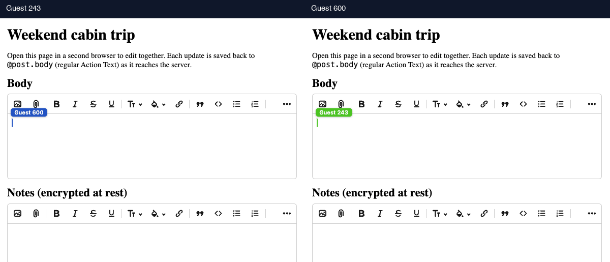
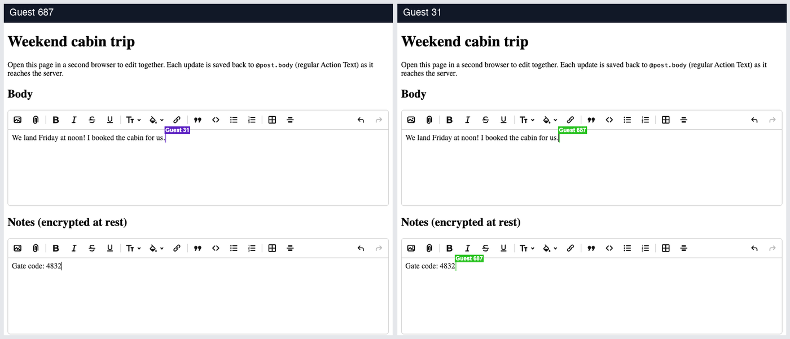

# Demo: collaborative posts

A small, real Rails app showing lexxy-realtime end to end: a `Post` with two
collaborative Action Text fields, edited together live and materialized back
to the record on the server. `body` is plain; `notes` is encrypted at rest
(`ActionText::EncryptedRichText` for the rendered HTML, `Y::EncryptedDocument`
for the collaborative document and its updates).



Key integration files:

- `app/models/post.rb`: `has_collaborative_rich_text :body` and
  `has_collaborative_rich_text :notes, encrypted: true`
- `app/views/posts/edit.html.erb`: `form.collaborative_rich_textarea :body`
- `app/channels/document_channel.rb` and the `y_documents` /
  `y_document_updates` migration, generated by
  `rails g lexxy_realtime:install`. The channel is the generated one with
  authorization opened up, since the demo has no users. The models ship in
  the yrby-rails gem.
- `app/javascript/application.js`: `import "lexxy-realtime"`
- `app/javascript/custom_nodes/index.js`: ecosystem Lexical nodes
  (hashtags, comment marks) registered with every editor, paired with
  `nodes:` render rules on `Post` (see [Custom nodes](#custom-nodes))
- `config/initializers/lexxy_realtime.rb`: guest identity for cursors.
  Without it, the default reads `current_user.name`, `username`, or
  `handle`.
- `config/application.rb`: Active Record encryption keys for the demo
  database. A real app generates keys with `bin/rails db:encryption:init`
  and keeps them in credentials.

## Run it

```bash
bundle install
npm --prefix .. install   # the demo builds the repo's package first
npm install
npm run build
bin/rails db:prepare
bin/rails server
```

Or `bin/setup`, which installs everything and starts the dev server (the
build runs there as a watcher).

Create a post, open its edit page in two browser windows, and type in both.
The two fields sync independently: each has its own document and its own
field-scoped token, and both editors share one Action Cable connection.



Then open the post's show page: each collaborative document has been rendered
to HTML on the server (no Node) and saved as regular Action Text. The notes
rows in `y_documents`, `y_document_updates`, and `action_text_rich_texts`
hold ciphertext.


## Custom nodes

The demo registers two Lexical node packages with every editor, through
Lexxy's extension API: subclass its `Extension`, return a Lexical extension
from `lexicalExtension`, and pass the class to `configure()`. The nodes join
the editor's node list, which is also where the collaboration binding picks
them up — so they sync between clients like any built-in node. The wiring is
`app/javascript/custom_nodes/index.js`.

- `@lexical/hashtag`: typing `#word` creates a `HashtagNode`, styled through
  the editor theme.
- `@lexical/mark`: the toolbar's comment button wraps the selection in a
  `MarkNode` (`<mark>`), the building block for comment threads.

The server renders the stored document without running any of that
JavaScript, so `Post` declares a render rule for the mark:

```ruby
has_collaborative_rich_text :body, nodes: {
  "mark" => { tag: "mark", attrs: { "class" => "comment-mark" } }
}
```

Without the rule, `MarkNode` is an unknown element node and the marked text
is dropped from the saved body entirely — while both live editors keep
showing it. There is no rule for hashtags, deliberately: a `HashtagNode` is
a `TextNode` subclass, which syncs as a plain text run, and text runs
materialize as their text (rules can't target them). `#word` survives in
the saved body as plain text, just without the span.

`script/check_custom_nodes.rb` (a `bin/ci` step) replays a document the two
live editors produced — `script/fixtures/custom_nodes_body.update.b64` —
through the model and asserts both behaviors.

## Notes

- Action Cable runs on Solid Cable: broadcasts go through a separate
  SQLite database (`storage/*_cable.sqlite3`, created by `db:prepare`),
  so sync works across multiple server processes with no Redis.
- The Gemfile loads `lexxy-realtime` from `../rails`. Bundler resolves its
  yrby dependencies from RubyGems. `package.json` loads the root JavaScript
  package through `file:..`, and `npm run build` compiles that package
  before bundling the app; the compiled `dist/` is never committed.
- The esbuild `--alias` flags exist because a `file:` dependency is a
  symlink: it would otherwise pull second copies of `lexical`/`yjs` from
  the repo's own node_modules, and npm does not install a linked package's
  peer dependencies, so the Yjs family aliases point at the repo's copies.
  Registry installs bring the peers in and deduplicate them without any of
  this.
